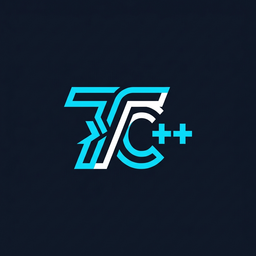

# TurboVs — Turbo C++ for Visual Studio Code

<div align="center">

  

  <h1>TurboVs</h1>

  <p><strong>Run legacy Turbo C++ programs (<code>&lt;iostream.h&gt;</code>, <code>&lt;conio.h&gt;</code>, <code>&lt;graphics.h&gt;</code>) directly in Visual Studio Code</strong></p>

[](https://github.com/beyondbday69/turbovs/actions)
[](CHANGELOG.md)
[](LICENSE)
[](#)

</div>

---

## 🚀 Overview

Many schools, universities, competitive programming curriculums, and retro developers still write code relying on legacy Turbo C++ libraries and conventions. Modern compilers (GCC, Clang, MSVC) reject classic headers like `<iostream.h>`, `<conio.h>`, or `void main()`.

**TurboVs** connects the modern Visual Studio Code editor with authentic Turbo C++ 3.0 compilation:

- **Pure Script Output Only**: Clean integrated terminal output showing exclusively your program's stdout/stderr. All bash prompt echoes, command lines, ALSA sound card warnings, and DOSBox startup noise are completely suppressed using a custom VS Code Pseudoterminal.
- **Dedicated Separate Input Panel**: Scans your source code before running to detect how many inputs are needed (`cin >>`, `scanf`, `cin.getline`, `getch`) and provides individual input card fields for each variable with live piping.
- **Genuine Borland TCC Engine**: Real compilation using genuine `TCC.EXE` — no modern shims or syntax translations. Full support for classic functions: `clrscr()`, `getch()`, `getche()`, `gotoyx()`, `textbackground()`, `textcolor()`, and `<graphics.h>` BGI modes.
- **Editor Line Diagnostics**: Automatically parses compiler error messages and places squiggles directly on the offending source lines.
- **Cross-Platform**: Works smoothly on Windows, Linux, and macOS.

---

## 📋 Dedicated Separate Input Panel & Input Detection

No more unresponsive stdin, hanging prompts, or confusing multiline piping:

1. **Automatic Input Detection**: TurboVs statically analyzes the active script before execution, detecting every `cin >>`, `scanf`, `cin.getline`, `gets`, and `getch` call.
2. **Context-Aware Labels**: Extracts user-facing prompt labels from preceding `cout <<` and `printf(...)` statements (e.g. `"Enter first number:"`, `"Enter operator:"`).
3. **Separate Input Fields**: Each required input gets an individual card box with its variable name, prompt label, and clear input field.
4. **Live Token Preview**: Displays a real-time preview of the piped sequence (e.g. `Piped: [ 10 ] ↵ [ + ] ↵ [ 5 ] ↵ [ q ]`) as you type.
5. **Real-time Disk Sync**: Keystrokes are immediately synchronized to `TC_IN.TXT` so your inputs are guaranteed to reach the program on run.
6. **Dual Mode**: Easily switch between "📋 Separate Input Fields" and "📝 Raw Multiline Stdin" with one click.

---

## ⌨️ Shortcuts & Commands

| Command | Shortcut | Description |
| :--- | :--- | :--- |
| `TurboVs: Run Program` | `Ctrl+F9` (`Cmd+F9`) | Saves, compiles, and runs active file with pure script output |
| `TurboVs: Input Panel (Separate Fields per Input)` | Title Bar / Palette | Opens dedicated input panel with individual card per input |
| `TurboVs: Open Input/Output Panel` | Title Bar / Palette | Opens full interactive I/O panel with stdin & pure stdout |
| `TurboVs: Check Script Inputs` | Command Palette | Scans active script and reports detected input count & prompts |
| `TurboVs: Set Program Input` | Command Palette | Quick input box to pre-supply stdin before running |
| `TurboVs: Stop Program` | `Ctrl+Shift+F9` | Terminates currently running program / DOSBox process |
| `TurboVs: Open in Turbo C++ IDE` | Command Palette | Launches the classic full-screen blue Borland TC IDE |
| `TurboVs: Check Environment Status` | Command Palette | Diagnoses DOSBox executable and Turbo C++ directory paths |
| `TurboVs: Configure Settings` | Command Palette | Interactive configuration wizard |

---

## ☁️ Test TurboVs in Your Browser (No Local Setup Required!)

You can run TurboVs inside a complete **Cloud VS Code Server** directly on GitHub Actions:

1. Navigate to **[GitHub Actions → TurboVs Cloud VS Code Server](https://github.com/beyondbday69/turbovs/actions/workflows/vscode-server.yml)**.
2. Click **Run workflow** (choose duration, e.g. 120 minutes).
3. Within 30 seconds, open the workflow **Summary** page for your one-click access link.
4. Click the link to open full Visual Studio Code in your browser with:
   - Genuine Turbo C++ 3.0 (`TCC.EXE`, `TC.EXE`, headers, libraries, BGI) pre-configured.
   - Pre-installed **TurboVs** extension.
   - Pre-loaded example programs (`hello.cpp`, `calculator.cpp`, `fibonacci.c`, `student_db.cpp`, `graphics_demo.cpp`).
5. Open any example and press **`Ctrl+F9`** or click the **Play** button!

---

## 📥 Quick 1-Click Installation (For Local Machine)

### Windows (Automated All-in-One):
1. Download [`install-globally.bat`](https://github.com/beyondbday69/turbovs/releases/latest/download/install-globally.bat).
2. Double-click it. It will:
   - Install the **TurboVs** extension globally into VS Code.
   - Automatically install **DOSBox** using `winget` (if not already installed).
   - Verify your `C:\TURBOC3` directory.

### Linux / macOS:
```bash
curl -fsSL https://raw.githubusercontent.com/beyondbday69/turbovs/main/install-globally.sh | bash
```

### Manual VSIX Installation:
1. Download [`turbovs-1.1.0.vsix`](https://github.com/beyondbday69/turbovs/releases/latest/download/turbovs-1.1.0.vsix) from [GitHub Releases](https://github.com/beyondbday69/turbovs/releases).
2. In VS Code, press `Ctrl+Shift+X` → `...` menu → **Install from VSIX...**

---

## ⚙️ Configuration Settings

Open VS Code Settings (`Ctrl+,` or `Cmd+,`) and search for `turbovs`:

| Setting | Type | Default | Description |
| :--- | :--- | :--- | :--- |
| `turbovs.dosboxPath` | `string` | `""` (auto-detect) | Path to `dosbox` or `dosbox-x` executable. |
| `turbovs.compilerPath` | `string` | `""` (auto-detect) | Path to Turbo C++ installation directory (containing `BIN`, `INCLUDE`, `LIB`). |
| `turbovs.workspacePath` | `string` | `""` (auto) | Custom host folder mounted as drive `D:`. Defaults to current file's folder. |
| `turbovs.autoClearTerminal` | `boolean` | `true` | Clears the "TurboVs" terminal before compiling. |
| `turbovs.closeOnExit` | `boolean` | `true` | Exits DOSBox after the user presses a key when the program finishes. |
| `turbovs.windowResolution` | `string` | `"1024x768"` | DOSBox window resolution (`"original"`, `"800x600"`, `"1024x768"`, `"fullscreen"`). |
| `turbovs.memoryModel` | `string` | `"default"` | Memory model passed to `TCC` (`default`, `-ms`, `-mm`, `-mc`, `-ml`, `-mh`). |
| `turbovs.dosboxArgs` | `string` | `""` | Additional command-line flags to pass to DOSBox. |

---

## 📝 Example Turbo C++ Program

```cpp
#include <iostream.h>
#include <conio.h>

void main() {
    clrscr();
    
    char name[50];
    int age;
    
    cout << "========================================" << endl;
    cout << "        Welcome to TurboVs!             " << endl;
    cout << "========================================" << endl;
    
    cout << "Enter your name: ";
    cin >> name;
    
    cout << "Enter your age: ";
    cin >> age;
    
    cout << "\nHello, " << name << "! You are " << age << " years old." << endl;
    cout << "\nPress any key to finish...";
    
    getch();
}
```

---

## 📄 License

This extension is licensed under the [MIT License](LICENSE).
