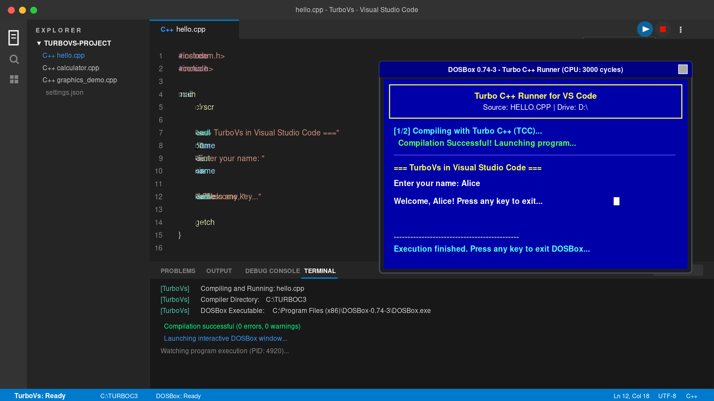
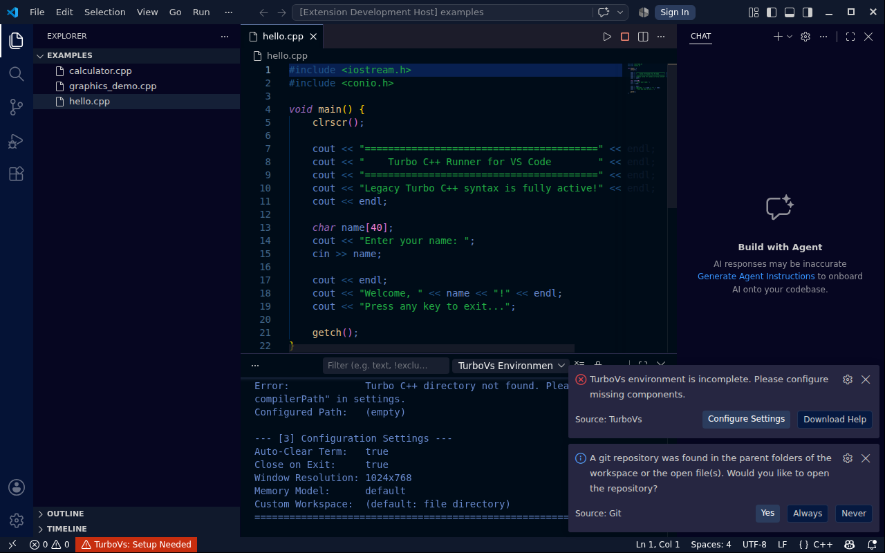

# TurboVs — Turbo C++ for Visual Studio Code

<div align="center">

[](https://github.com/beyondbday69/turbovs/actions)
[](https://github.com/beyondbday69/turbovs/actions)
[](CHANGELOG.md)
[](LICENSE)
[](#)

<br/>



<p><em>Visual Studio Code running legacy Turbo C++ code interactively with the TurboVs extension and DOSBox CRT display</em></p>

</div>

---

## 🚀 Overview

Many schools, universities, competitive programming curriculums, and retro developers still write code relying on legacy Turbo C++ libraries and conventions. Modern compilers (GCC, Clang, MSVC) reject headers like `<iostream.h>`, `<conio.h>`, or `void main()`.

**TurboVs** bridges the modern VS Code editor with genuine Turbo C++ compilation inside DOSBox:
- **No syntax translation or modern shims** — Your code is compiled by genuine Borland `TCC.EXE`.
- **Full interactive keyboard & console support** — `getch()`, `clrscr()`, `cin >>`, `scanf()`, and `getche()` work smoothly.
- **BGI Graphics mode support** — Run programs using `<graphics.h>` with authentic 640x480 VGA graphics.
- **Modern VS Code developer experience** — One-click Run button, editor line error squiggles, command palette, and integrated terminal feedback.

---

## 📸 What TurboVs Looks Like

<div align="center">
  
  <p><em>Captured live in GitHub Actions CI: Real Visual Studio Code running TurboVs with <code>examples/hello.cpp</code> and TurboVs diagnostics</em></p>
</div>

As shown in the screenshot above:
1. **Editor Tab**: Open any `.cpp` or `.c` file with classic syntax (`#include <iostream.h>`, `#include <conio.h>`, `void main()`, `clrscr()`).
2. **Run/Play Button**: Click the **Run with TurboVs** (`$(play)`) button in the top right editor tab or press `Ctrl+F9`.
3. **Integrated Terminal (`TurboVs`)**: The bottom panel opens a dedicated terminal displaying real-time build and launch status.
4. **Authentic DOSBox Window**: The classic CRT blue console window opens, executing your program with full interactive keyboard input (`cin`, `getch()`) and screen graphics.
5. **Status Bar & Environment**: The status bar shows TurboVs status and diagnostics output channel.

---

## ⌨️ Shortcuts & Commands

| Command | Shortcut | Description |
| :--- | :--- | :--- |
| `TurboVs: Run Program` | `Ctrl+F9` (`Cmd+F9`) | Saves, compiles, and runs active file |
| `TurboVs: Stop Program` | `Ctrl+Shift+F9` | Kills running DOSBox session |
| `TurboVs: Open in Turbo C++ IDE` | Command Palette | Launches the classic blue Borland IDE |
| `TurboVs: Check Environment Status` | Command Palette | Diagnoses DOSBox and compiler paths |
| `TurboVs: Configure Settings` | Command Palette | Quick configuration wizard |

## ☁️ Test TurboVs in Your Browser (No Local Setup Required!)

You can run TurboVs inside a complete **Cloud VS Code Server** directly on GitHub Actions:

1. Navigate to **[GitHub Actions → TurboVs Cloud VS Code Server](https://github.com/beyondbday69/turbovs/actions/workflows/vscode-server.yml)**.
2. Click **Run workflow** (choose your desired duration, e.g. 120 minutes).
3. Within 30 seconds, open the workflow **Summary** page for your one-click access link.
4. Click the link to open full Visual Studio Code in your browser with:
   - Genuine Turbo C++ 3.0 (`TCC.EXE`, `TC.EXE`, headers, libraries, BGI) pre-configured.
   - Pre-installed **TurboVs** extension.
   - Live DOSBox CRT display with keyboard & mouse input.
   - Pre-loaded example programs (`hello.cpp`, `calculator.cpp`, `fibonacci.c`, `matrix_calc.cpp`, `student_db.cpp`, `graphics_demo.cpp`, `text_animation.cpp`).
5. Open any example and press **`Ctrl+F9`** or click the **Play** button!

---

## 📥 Quick 1-Click Installation (For Local Machine)

### Windows (Automated All-in-One):
1. Download [`install-globally.bat`](https://raw.githubusercontent.com/beyondbday69/turbovs/main/install-globally.bat).
2. Double-click it. It will:
   - Install the **TurboVs** extension globally into VS Code.
   - Automatically install **DOSBox** using `winget`.
   - Verify your `C:\TURBOC3` directory.

### Linux / macOS:
```bash
curl -fsSL https://raw.githubusercontent.com/beyondbday69/turbovs/main/install-globally.sh | bash
```

---

## ⚙️ Configuration Settings

Open VS Code Settings (`Ctrl+,` or `Cmd+,`) and search for `turbovs`:

| Setting | Type | Default | Description |
| :--- | :--- | :--- | :--- |
| `turbovs.dosboxPath` | `string` | `""` (auto-detect) | Path to `dosbox` or `dosbox-x` executable. |
| `turbovs.compilerPath` | `string` | `""` (auto-detect) | Path to Turbo C++ installation directory (containing `BIN`, `INCLUDE`, `LIB`). |
| `turbovs.workspacePath` | `string` | `""` (auto) | Custom host folder mounted as drive `D:`. Defaults to current file's folder. |
| `turbovs.autoClearTerminal` | `boolean` | `true` | Clears the "TurboVs" terminal before compiling. |
| `turbovs.closeOnExit` | `boolean` | `true` | Exits DOSBox after the user presses a key when the program finishes. |
| `turbovs.windowResolution` | `string` | `"1024x768"` | DOSBox window resolution (`"original"`, `"800x600"`, `"1024x768"`, `"fullscreen"`). |
| `turbovs.memoryModel` | `string` | `"default"` | Memory model passed to `TCC` (`default`, `-ms`, `-mm`, `-mc`, `-ml`, `-mh`). |
| `turbovs.dosboxArgs` | `string` | `""` | Additional command-line flags to pass to DOSBox. |

---

## 📝 Example Turbo C++ Program

```cpp
#include <iostream.h>
#include <conio.h>

void main() {
    clrscr();
    
    char name[50];
    int age;
    
    cout << "========================================" << endl;
    cout << "        Welcome to TurboVs!             " << endl;
    cout << "========================================" << endl;
    
    cout << "Enter your name: ";
    cin >> name;
    
    cout << "Enter your age: ";
    cin >> age;
    
    cout << "\nHello, " << name << "! You are " << age << " years old." << endl;
    cout << "\nPress any key to finish...";
    
    getch();
}
```

---

## 📄 License

This extension is licensed under the [MIT License](LICENSE).
